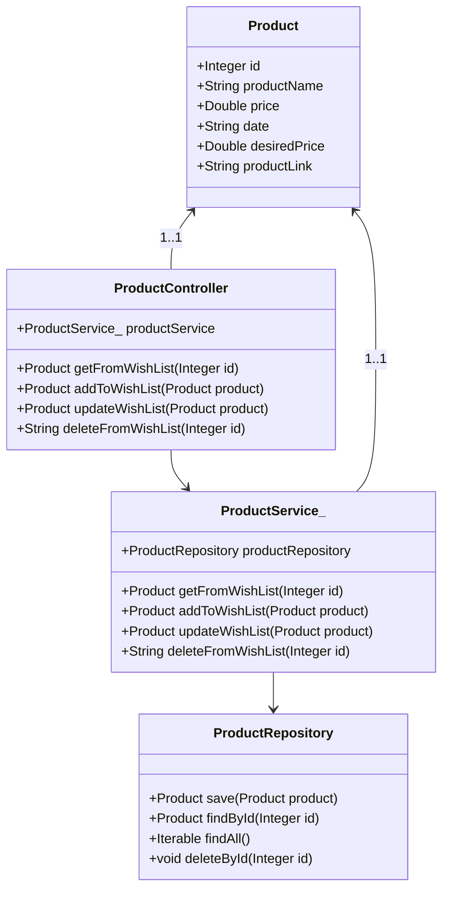

# Desafio-API-DIO

## Diagrama de Classes

```mermaid
classDiagram
    class Product {
        +Integer id
        +String productName
        +Double price
        +String date
        +Double desiredPrice
        +String productLink
    }
    class ProductController {
        +ProductService_ productService
        +Product getFromWishList(Integer id)
        +Product addToWishList(Product product)
        +Product updateWishList(Product product)
        +String deleteFromWishList(Integer id)
    }
    class ProductService_ {
        +ProductRepository productRepository
        +Product getFromWishList(Integer id)
        +Product addToWishList(Product product)
        +Product updateWishList(Product product)
        +String deleteFromWishList(Integer id)
    }
    class ProductRepository {
        +Product save(Product product)
        +Product findById(Integer id)
        +Iterable<Product> findAll()
        +void deleteById(Integer id)
    }
    ProductController --> ProductService_
    ProductService_ --> ProductRepository
    Product <-- ProductController : 1..1
    Product <-- ProductService_ : 1..1
```
